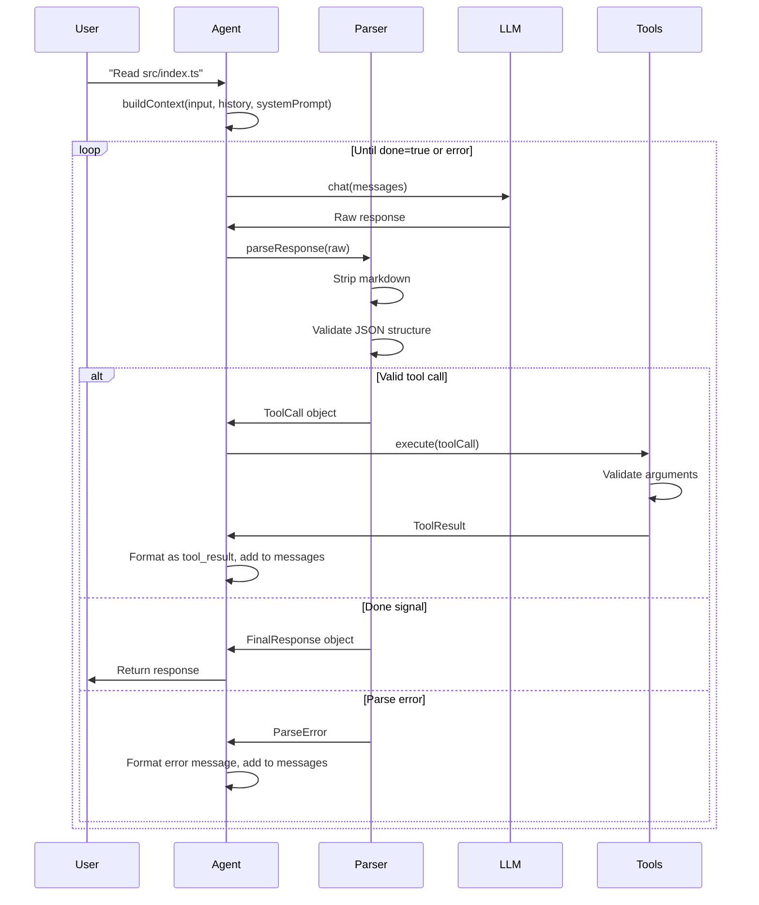

## Architecture Principles

1. **Separation of Concerns**: Each module has single responsibility
2. **Dependency Injection**: Services passed to agent, not instantiated internally
3. **Interface-based Design**: Classes implement interfaces for testability
4. **Functional Core**: Pure functions for transformations, classes for state
5. **Type Safety**: Runtime validation + compile-time type checking
6. **KISS**: Keep it simple - one way to do things, no optional complexity

---

## Project Structure

```
rag-enabled-agent/
├── src/           # Source code
│   ├── agent/     # Agent orchestration loop, parsing, validation
│   ├── llm/       # LLM service abstraction and implementations
│   ├── tools/     # Tool registry and tool definitions
│   ├── conversation/  # Message history management
│   ├── context/   # Context building and prompt generation
│   ├── cli/       # Command-line interface
│   └── utilities/ # Shared utilities (HTTP, file system, etc.)
│
├── docs/          # Documentation
├── tests/         # Test suites (integration, unit, fixtures, mocks)
└── sandbox/       # Testing playground
```

---

## Core Type System

### Key Data Structures

```typescript
type Message = {
  role: 'system' | 'user' | 'assistant';
  content: string;
};

type ToolCall = {
  tool: string;
  args: Record<string, unknown>; // Required, can be empty {}
};

type ToolResult = {
  success: boolean;
  data?: unknown;
  error?: string;
};

type ToolMetadata = {
  name: string;
  description: string;
  parameters: Record<string, unknown>; // For documentation
};

type Tool = ToolMetadata & {
  argsSchema: ValidationSchema; // Runtime validation schema
  execute: (args: Record<string, unknown>) => Promise<ToolResult>;
};

type AgentConfig = {
  maxIterations: number;
  contextLimitThreshold: number; // e.g., 0.8 for 80%
  maxTokens: number;
};

type AgentServices = {
  llm: LlmService;
  conversation: ConversationService;
  tools: ToolRegistry;
};

type AgentMetrics = {
  iterations: number;
  toolCalls: number;
  parseErrors: number;
  toolFailures: number;
  contextLimitReached: boolean;
};

type AgentResult = {
  success: boolean;
  response?: string;
  error?: string;
  metrics: AgentMetrics;
};

type Conversation = {
  id: string;
  messages: Message[];
  createdAt: number;
  updatedAt: number;
};
```

---

## Design Decisions

### 1. Tool Calling Protocol: JSON with Markdown Stripping

**Format:**

```json
{
  "tool": "file_read",
  "args": {
    "path": "src/index.ts"
  }
}
```

**Rationale:**

- Structured output format is easier to parse
- JSON is familiar and well-structured
- Runtime validation catches LLM errors early

**Implementation:**

- System prompt instructs model to output raw JSON (no markdown)
- Parser strips markdown fences defensively (```json blocks)
- Schemas validate structure and types before execution

**Learning Note:** Consider trying ReAct format in an experiment to see if showing reasoning helps the model

---

### 2. Agent Loop Control: Explicit Completion Signal

**Completion Format:**

```json
{
  "done": true,
  "response": "Final answer here..."
}
```

**Detection Logic:**

1. Check for `done: true` → return response to user
2. Check for `tool` field → execute tool and continue loop
3. Neither → treat as error, add error message and retry

**Rationale:**

- Explicit signals are clearer for small models
- Easy to detect and implement
- Can evolve implementation later without breaking contract

---

### 3. Error Recovery: Explicit Error Feedback

**Strategy:**

**On parse error:**
- Add system message to conversation
- Include error description
- List available tools with signatures
- Show example of correct format
- Remind about completion signal

**On tool execution error:**
- Add system message to conversation
- Include tool name and error details
- Suggest alternative approach

**Rationale:**

- Small models benefit from explicit guidance
- Clear error messages help model self-correct
- Includes examples of correct format

---

### 4. Context Management: Token Tracking with Hard Limit

**Phase 1 Approach:**

```typescript
type ContextState = {
  messages: Message[];
  totalTokens: number; // Approximate count
  maxTokens: number;   // Model's context window
};

// Token estimation: simple heuristic
function estimateTokens(text: string): number;

// Hard limit check
function isContextLimitReached(
  totalTokens: number,
  maxTokens: number,
  threshold: number // e.g., 0.8
): boolean;
```

**Rationale:**

- Start simple, understand token usage patterns
- Hard limit prevents context overflow
- Forces new conversation (acceptable for Phase 1)

**Future Enhancements:**

- Sliding window (keep last N messages)
- Summarization of old messages
- Smart pruning (remove tool results after use)

**Learning Note:** Track actual vs estimated tokens to calibrate your heuristic

---

### 5. Tool Result Format: Structured JSON

**Format:**

```json
{
  "tool_result": {
    "tool": "file_read",
    "success": true,
    "data": "file contents..."
  }
}
```

**On failure:**

```json
{
  "tool_result": {
    "tool": "file_read",
    "success": false,
    "error": "File not found: src/missing.ts"
  }
}
```

**Rationale:**

- **Clear Success/Failure**: Model knows immediately if tool worked
- **Consistent Format**: Every tool result has same structure
- **Easy Error Handling**: Model can check `success` field
- **Debuggability**: Structured logs are easier to inspect
- **Future-Proof**: Can add metadata (timing, token cost, etc.)

**Why Not Alternatives:**

- Raw content: Model must infer success/failure
- Conversational: Wastes tokens, adds ambiguity
- Structured: Best signal-to-noise for small models

---

### 6. JSON Parsing: Belt and Suspenders

**Two-Layer Approach:**

**Layer 1 - System prompt instruction:**
- Instruct: "Output raw JSON only. No markdown code blocks."
- Include examples of correct/incorrect format

**Layer 2 - Parser strips markdown defensively:**
- Remove \`\`\`json markers
- Remove \`\`\` markers  
- Trim whitespace
- Then parse as JSON

**Rationale:**

- Models don't always follow instructions
- Defense in depth prevents parsing failures
- Small overhead for robustness

---

### 7. Tool Arguments: Required Object with Validation

**Design:**

```
Tool:
  - name: string
  - description: string
  - parameters: object (for documentation)
  - argsSchema: validation schema
  - execute: function(args) -> Promise<ToolResult>

ToolCall:
  - name: string
  - args: object (required, can be empty {})
```

**Example:**

```typescript
type FileReadArgs = {
  path: string;
};

const fileReadTool: Tool = {
  name: "file_read",
  description: "Read file contents",
  parameters: { path: "string - Path to file" },
  argsSchema: fileReadArgsSchema, // Validates FileReadArgs at runtime
  execute: async (args: FileReadArgs) => {
    // Implementation validates, reads, returns result
  }
};
```

**Rationale:**

- **Type Safety**: Compile-time type checking
- **Runtime Validation**: Catches LLM mistakes before execution
- **Consistent Structure**: Every tool call has args (can be `{}`)
- **Simple**: One way to define tools, no optional complexity
- **Better Errors**: Validation provides clear error messages

---

## Agent Loop Flow



---

## Module Design

### Classes vs Functions

**Classes (Stateful Services):**

- LLM Service - Manages HTTP connections, model configuration
- Tool Registry - Maintains tool catalog, handles execution
- Conversation Service - Tracks message history

**Functions (Pure Logic):**

- Agent orchestration - Coordinates the main loop
- Context building - Assembles message arrays
- Response parsing - Converts strings to structured data
- Text transformation - Cleans and formats text

---

### Service Interfaces

**LLM Service:**
```typescript
interface LlmService {
  chat(messages: Message[]): Promise<string>;
}
```

**Implementation responsibilities:**
- Validate input messages
- Make HTTP call to LLM API
- Validate API response
- Extract and return assistant message content
- Handle network errors and timeouts

---

**Tool Registry:**
```typescript
interface ToolRegistry {
  register(tool: Tool): void;
  execute(toolCall: ToolCall): Promise<ToolResult>;
  list(): ToolMetadata[];
}
```

**Implementation responsibilities:**
- Maintain map of tool name → tool definition
- Prevent duplicate tool registration
- Validate tool call structure before execution
- Validate arguments against tool's schema
- Execute tool and catch exceptions
- Return structured result (success/failure)

---

**Conversation Service:**
```typescript
interface ConversationService {
  create(initialMessages?: Message[]): Promise<Conversation>;
  add(message: Message): Promise<void>;
  getAllMessages(): Promise<Message[]>;
  clear(): Promise<void>;
  estimateTokens(): Promise<number>;
}
```

**Implementation responsibilities:**
- Store messages in repository
- Validate message structure before adding
- Estimate token usage (chars / 4 heuristic)
- Track conversation metadata (timestamps, IDs)
- Handle concurrent access if needed

---

### Tool Definitions

**Example: File Read Tool**
```typescript
type FileReadArgs = {
  path: string;
};

const fileReadTool: Tool = {
  name: "file_read",
  description: "Read contents of a file",
  parameters: {
    path: "string - Path to file"
  },
  argsSchema: fileReadArgsSchema, // Validates { path: string }
  execute: async (args: FileReadArgs) => {
    // Read file, return { success: true, data: content }
    // Or on error: { success: false, error: message }
  }
};
```

**Example: Calculator Tool**
```typescript
type CalculatorArgs = {
  operation: 'add' | 'subtract' | 'multiply' | 'divide';
  a: number;
  b: number;
};

const calculatorTool: Tool = {
  name: "calculator",
  description: "Perform basic arithmetic",
  parameters: {
    operation: "'add' | 'subtract' | 'multiply' | 'divide'",
    a: "number - First operand",
    b: "number - Second operand"
  },
  argsSchema: calculatorArgsSchema, // Validates CalculatorArgs
  execute: async (args: CalculatorArgs) => {
    // Perform operation, return result
    // Check for division by zero
    // Return { success: true, data: result } or { success: false, error }
  }
};
```

**Rationale:**

- Simple object definitions, not complex classes
- Easy to test (just functions)
- Natural for registry pattern
- Validation handled before execution
- Can add sophisticated tools as needed

---

## System Prompt Design

**System prompt structure:**

1. **Role**: "You are a helpful AI assistant with access to tools"

2. **Response Format Instructions**:
   - Output valid JSON only
   - No markdown, no explanations outside JSON

3. **Tool Call Format**: `{ "tool": "tool_name", "args": { ... } }`

4. **Completion Format**: `{ "done": true, "response": "..." }`

5. **Available Tools**: For each tool, list name, description, and parameters

6. **Tool Result Format**:
   - Success: `{ "tool_result": { "tool": "name", "success": true, "data": ... } }`
   - Failure: `{ "tool_result": { "tool": "name", "success": false, "error": "..." } }`

7. **Important Reminders**:
   - Always output valid JSON
   - No markdown code blocks
   - Check `tool_result.success` before proceeding
   - Can make multiple tool calls before completion

---

## Dependency Injection Pattern

**Service initialization:**
1. HTTP client (for LLM communication)
2. LLM service (with client and model name)
3. Conversation repository (storage backend)
4. Conversation service (with conversation ID and repository)
5. Tool registry (with registered tools)

**Agent initialization:**
1. Get tool metadata from registry
2. Build system prompt with available tools
3. Create agent config (max iterations, context limits)
4. Execute agent with user input, system prompt, services, config

**Result handling:**
- Format and display result
- Show metrics if requested

**Rationale:**

- Explicit dependencies make testing easier
- Can swap implementations (mock services, different tools)
- Clear initialization order
- Services composed at application entry point

---

## Implementation Phases

### Phase 1: Core Agent Loop

**Goals:**

- Understand agent mechanics
- Handle tool calling protocol
- Deal with failure modes

**Tasks:**

1. Setup project structure and dependencies
2. Implement LLM service with HTTP client
3. Implement response parser (markdown stripping, validation)
4. Implement tool registry
5. Create first tool (file read)
6. Implement agent orchestration loop
7. Add integration tests for single-tool and multi-tool workflows

**Success Criteria:**

- Agent can call file_read tool
- Agent handles malformed responses
- Agent completes with "done" signal
- Understand why it fails when it does

**Learning Experiment:** Once basic tool calling works, try the same prompt with temp=0, 0.3, and 0.7 to see the impact

---

### Phase 2: Additional Tools

**Goals:**

- Real-world agent behavior
- Error handling patterns

**Tasks:**

1. Add file write tool
2. Add command execution tool (run shell commands)
3. Implement error recovery strategies
4. Enhance conversation history management
5. Test multi-tool workflows

**Success Criteria:**

- Agent can chain multiple tool calls
- Agent recovers from errors
- Agent stays within context limits

**Learning Note:** Keep a tally of failure types (parse errors, tool failures, context overflow) to identify patterns

---

### Phase 3: CLI Interface

**Goals:**

- Usable tool for development

**Tasks:**

1. Add CLI framework
2. Implement interactive mode
3. Add command history
4. Pretty output formatting

**Success Criteria:**

- Can use agent from terminal
- Conversation persists across inputs
- Clear output formatting

---

## Testing Strategy

**Focus Areas:**

1. **Integration Tests** - Test component interactions
   - LLM service communication
   - Conversation management (CRUD, token estimation)
   - Tool registry (registration, validation, execution)
   - Parser and validator pipeline
   - Full agent loop behavior
   - End-to-end workflows

2. **Unit Tests** - Test isolated logic
   - Parser helpers
   - Context checking
   - Context building
   - Text transformations

3. **Test Infrastructure**
   - Fixtures: Sample LLM outputs, tool definitions
   - Mocks: HTTP client, repositories, registries
   - Graceful degradation when external services unavailable

**Key Principles:**

- Integration tests provide learning value for component interactions
- Mocks enable fast tests without external dependencies
- Fixtures document real failure modes
- High coverage without slowing development

---

## Open Questions for Implementation

1. **Token Counting:**
   - Use simple heuristic (chars / 4)?
   - Use tokenizer library?
   - Query Ollama API for token count?
   - **Learning:** Track actual vs estimated to calibrate

2. **Max Iterations:**
   - What's a reasonable limit? (10? 20?)
   - Should it be configurable?
   - **Learning:** Start with 10, see what tasks need more

3. **Tool Timeout:**
   - Should tools have execution timeout?
   - What's reasonable for file operations?
   - **Learning:** Add 5s default, log when timeouts occur

4. **Logging:**
   - How verbose should logging be?
   - File logging or just console?
   - Structured logs (JSON) or human-readable?
   - **Learning:** Start with verbose console logs, you can reduce later

5. **Configuration:**
   - What should be configurable? (model, base URL, max iterations, context limit)
   - Config file format?
   - Environment variables?
   - **Learning:** Start hardcoded, extract to config as patterns emerge

---

## Learning Artifacts

### Simple Experiment Log

Create `learning/experiments.md`:

```markdown
# Experiment Log

## Date: [Date]

**What I Tried:**
**Expected:**
**What Happened:**
**Surprised By:**
**Next Question:**

---
```

### Failure Patterns

As you discover failure modes, document them:

```markdown
# Failure Pattern: [Name]

**Frequency:** How often
**Trigger:** What causes it
**Solution:** What fixed it
**Insight:** What this teaches
```

---

## Success Metrics

**Technical:**

- Agent completes multi-tool workflows
- Error recovery works 80%+ of the time
- Context management prevents overflow
- Response parsing handles edge cases

**Learning:**

- Understand why agents fail
- Know when to retry vs give up
- Recognize prompt engineering importance
- See small model limitations
- Can predict failure modes from prompts
- Understand temperature impact on reliability

**Practical:**

- Actually use the tool for coding tasks
- Tool saves time vs manual work
- Can explain how it works to others

---

## Key Takeaways

1. **Keep It Simple**: One way to do things, no optional complexity
2. **Validate Everything**: Small models make mistakes, validation catches them
3. **Explicit Over Implicit**: Clear signals and error messages help models
4. **Type Safety**: Runtime validation + compile-time types = fewer bugs
5. **Learn By Doing**: Simple patterns reveal how agents work
6. **Document Surprises**: Write down what broke and why for future reference
